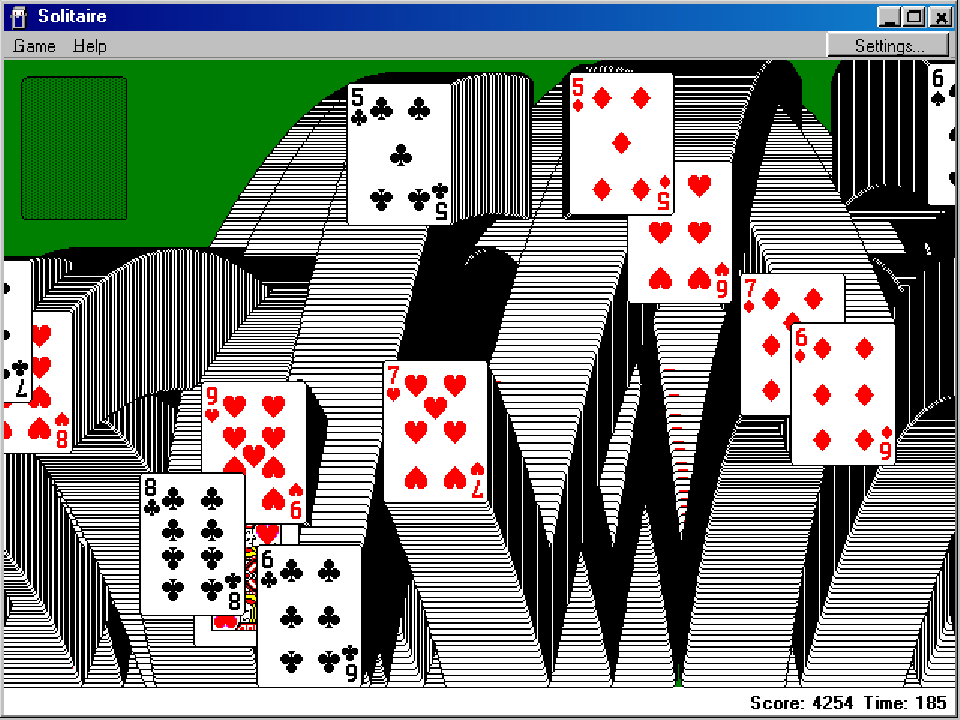
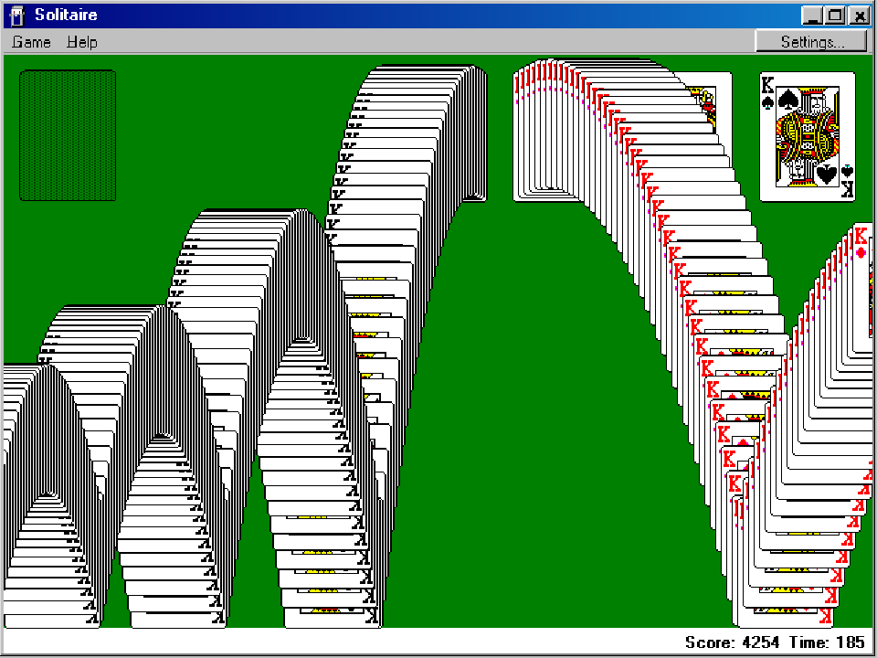

# Classic win animation — 0.12.2

The Windows 98 screenshot was reproduced with the existing renderer. It launched another card every 175 ms, allowing 14 active cards to draw intersecting trails at once. Trail stamps and variable-step physics ran on every display frame: identical elapsed time produced different images at 60, 120 and 144 fps, including the reported dense black-and-white bands.

The classic Klondike animation now advances and stamps at fixed 25 ms intervals, with one flying card at a time. Completed trails remain visible. The logical-resolution trail bitmap uses matching card rendering density in every classic edition. Delayed callbacks process at most eight steps; duplicate timestamps do not stamp again. Results appear after all 52 cards leave, with the existing click/Escape/Enter/Space skip behavior retained. The former 40-second cutoff was removed because a serial procession takes longer. Game state, score and elapsed time remain unchanged.

Validation: 425 focused checks across Windows 3.0 through XP, four display scales and 60/120/144 fps. Trail hashes match across frame rates. The complete 52-card sequence finishes, preserves the won deal and handles a long callback gap without an unbounded burst. An additional 2,370 fidelity regression checks passed, including Vista and Spider celebration coverage. Tests used silent, ephemeral windows; no user save was loaded or written. Build completed with zero warnings and errors.

Evidence and build logs are retained in `artifacts/classic-victory`. The before/after captures below use Windows 98 at 150%, sampled after six seconds at 144 display frames per second. This fixes the confirmed renderer behavior; it does not establish exhaustive timing equivalence with an original Windows 98 installation.

