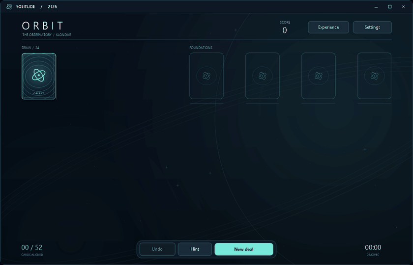
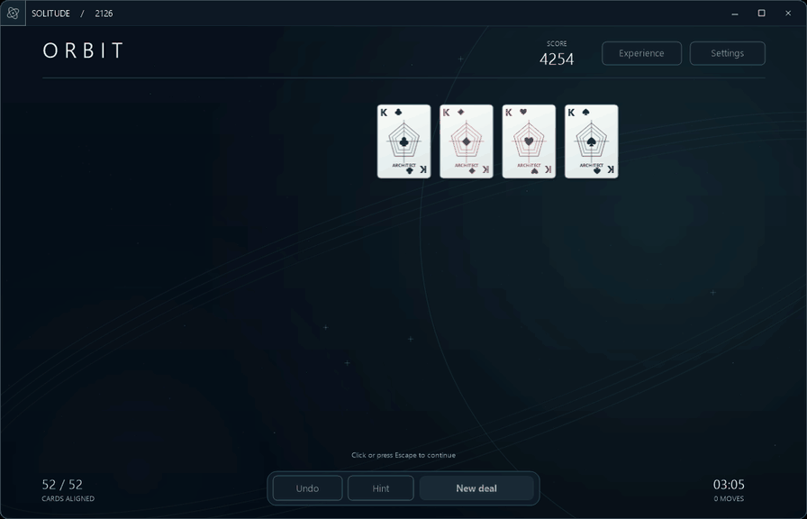

# ORBIT / Solitude 2126

ORBIT is a fictional edition of Solitude, imagined one century beyond 2026. It is a complete alternative Klondike presentation, available alongside the eight historical Windows presets in version 0.10.0. It does not claim to recreate a real Microsoft release. FreeCell and Spider remain available in their existing historical editions.

## A game inside an observatory

The design treats a future card table as a quiet observatory: a nearly black planetary horizon, thin orbital paths, distant stars and luminous foundation bays. The chrome, controls, dialogs, card backs and court cards share a geometric visual language. White porcelain-style faces keep familiar red/black suits and readable ranks; the court figures become Navigator, Sovereign and Architect motifs.

Three palettes change the cards, orbital light and scene accents: **Aurora** in teal, **Solstice** in gold and **Nebula** in violet. These are original procedural drawings rendered at the chosen display size. No new artwork, audio or fonts were downloaded for this edition.

## Motion with purpose

- Dealing fans cards from the stock with a staggered launch. A move rises along a shallow arc, banks and settles with a quintic easing curve. Turning cards compress around their center before revealing the new face.
- Subtle particles follow moving cards. Arriving foundation cards trigger expanding docking waves. Turning off light trails and waves removes those accents while keeping card motion.
- Hints outline the relevant piles and trace the transfer. A no-move message is brief and stays in the lower status area.
- A completed game peels all 52 cards off the foundations into a rotating formation, ripples flips through them, then settles them into four suit fans. The 7.6-second sequence finishes with score, time and move results. Click or Escape skips to results. See the [card motion update](ORBIT-CARD-MOTION-0.11.7.md).
- Turning **Spatial card motion** off makes moves, wins and edition switches immediate. The scene is static when idle. The corner logo animates only while hovered or its menu is open, and also respects reduced motion.

The active frame clock targets 120 updates per second, falling back to 60 when measured paint costs exceed that budget and recovering when costs fall. Actual display smoothness depends on hardware, window size and the Windows compositor. The [verification report](VERIFICATION.md) provides measured offscreen render costs and callback pacing, including larger-size limits.

These previews are sampled production-renderer frames, rather than a monitor capture or FPS measurement:

## Playing and choosing an edition

Open **Settings → ORBIT / Solitude 2126 → OK**, or press F6. Every edition centers on startup and after a switch, in the current monitor working area, respecting the taskbar. Switching into or out of ORBIT morphs the window into its new centered size over 0.9 seconds, with a light sweep and orbital arcs. Leaving reverses the sweep and contracts the arcs, retaining the departing palette. Escape skips to the finished window; disabling ORBIT's Spatial card motion makes either direction immediate. Settings remains at the top right. The action dock supplies Undo, Hint and New deal. The outlined **logo button in the top-left corner** opens the Game menu, including Restart, Statistics and the Flight manual. Its orbital mark rotates on hover and while the menu is open. **Complete the orbit** appears only when a simulation confirms safe collection can finish the current deal.

The playing grid is centered, with horizontal gaps of 16% of card width. Wider windows keep the columns together instead of stretching the gaps. Card sizing also respects the available window height so a full King-to-Ace run and six hidden cards can fit. It depends on the window size, not the current deal, so cards do not resize after each move. Compact windows reduce header and footer spacing. See the [spacing reference](ORBIT-SPACING-0.11.1.md) and [fitted layout update](ORBIT-POLISH-0.11.6.md).

Columns fit entirely in the window, without per-column scrolling, scrollbars or arrow buttons. Exposed strips retain at least 27% of card width for the rank and suit. All face-up cards remain available to mouse, keyboard and accessibility controls. Draw-three piles use wider spacing to expose those corner labels.

Repeated **Hint** requests cycle through alternative moves. Suggestions favor progress and exclude previously visited layouts. This is guidance, not a complete solver; when no unexplored suggestion is found, the game says so without declaring the deal unwinnable.

| Action | Input |
|---|---|
| Draw | Click the stock; Space with the stock selected |
| Move | Drag, or select a card and click its destination |
| Auto-place a card or valid sequence | Double-click its exposed card; foundation first, otherwise tableau |
| Collect safe foundation moves | Right-click the table |
| Undo | Dock button or Ctrl+Z |
| Hint | Dock button or H |
| New deal | Dock button or F2 |
| Restart current deal | Game menu or Ctrl+R |
| Help | F1 |
| Statistics | F4 |
| Experience | Header button or F5 |
| Editions and display size | Settings or F6 |
| Atmosphere palette | Experience → Atmosphere, or F7 |
| Game menu | Corner logo button or Alt+G |
| Keyboard piles | Left/Right/Tab, Enter/Space; Up/Down within a selected column |
| Cancel or skip a win | Escape |

ORBIT follows Klondike: descending alternating-color tableau columns, Kings in empty columns, foundations ascending by suit from Ace to King. It offers draw one/three and Standard, Vegas or no scoring, automatic exposed-card flips and full-session Undo. Double-click tries the chosen card's foundation first, then another legal tableau column; a valid attached sequence travels with it. Occupied columns take priority, with leftmost targets breaking ties. Moving an entire King-led column to an empty column is skipped because it makes no progress. Each double-click performs one move without collecting unrelated cards. Historical editions retain their existing double-click behavior. Experience displays the active deal's rules; if shared next-deal rules differ, a separate button offers to adopt them. Applying unchanged active rules preserves both the deal and the shared next-deal preference. Changing active rules starts a new deal.

## Persistence and accessibility choices

ORBIT saves the active deal and Undo history automatically. Switching to another edition suspends it; returning restores it. Draw count and scoring are shared with compatible Klondike presets. Palette, motion, sound and lighting are specific to ORBIT, while display size remains global. Selecting a different era does not copy future animation or artwork into it.

Experience edits remain a draft until Apply. Opening Atmosphere from Experience preserves that draft. Applying a nested palette returns to Experience; cancelling Experience discards the whole draft. Opening Atmosphere directly with F7 applies the palette on its own.

Display sizes are 100%, 125%, 150% and 200%, with an 800 × 540 logical minimum. Effective scale reduces automatically when the requested size cannot fit the monitor's work area; the saved scale preference stays intact. Cards use cached art at device resolution, full-frame rendering avoids stale alpha edges, and the static board cache excludes cards still owned by an animation. Tests compare cached and freshly rebuilt frames, including the animation deadline/cleanup gap.

Experience includes saved sound volume and reduced-motion controls. Cards, piles, buttons and dialog choices expose accessibility names, roles, state, bounds and actions, with focus/navigation and move announcements. Automated checks exercise the accessible objects, including revealing an offscreen card. End-to-end Narrator testing remains outstanding.

## Source and validation

The original graphics live in `src/FutureArt.cs`; window controls in `src/Skin.Future.cs`; presentation, settings and synthesized sound in `src/GameWindow.Future*.cs`. The existing Klondike engine supplies legal moves, scoring, Hint, Undo and persistence. `tests/FutureChecks.cs` covers edition availability, three palettes at four scales, nested settings, double-click scope, saved sessions, small-window layouts and both animated and reduced-motion wins. Shared motion tests also exercise Undo in the middle of an ORBIT flip.

This release was validated with isolated offscreen production renders and input handlers. Monitor-visible animation, audio output, clean-machine operation and a prolonged visible-session soak remain unverified.
