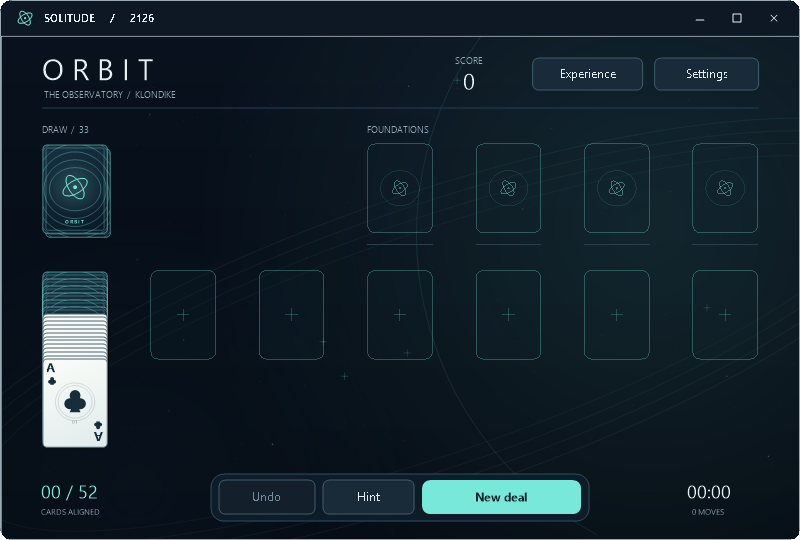

# ORBIT audit — 11 September 2026

ORBIT has a solid rules and rendering foundation, but it is not yet consistently readable, helpful or accessible. The most consequential findings are compressed card columns, misleading settings for a resumed deal, cycling hints, an unreliable completion offer, and missing accessibility semantics. Larger animation workloads also exceed the intended frame budget.

Audited baseline: **Solitude 0.10.1**, commit `ea875723195ae7b316cc32d58daa7ed49dde4600`. Scope: the fictional ORBIT Klondike edition, including the shared engine, session storage and settings it uses. This is an audit with reproducible probes, not an application fix or new release. The delivered `dist/Solitude.exe` remains unchanged; SHA-256 `64646E0E5CB2100D60E39A41A3B45DF27A656A5261404708753C36C1CC3D1CC6`.

## Evidence and coverage

- **689 ORBIT UI checks passed** in the existing suite.
- **53 shared rules/persistence test groups passed**, including 60,000-action card conservation, malformed-save recovery and exploration across the 17 historical game/profile combinations.
- Added ten focused diagnostic probes, all completing without probe exceptions, plus cold/stock/win rendering measurements. Probes use production handlers and the production renderer through ephemeral forms.
- Reviewed rendering, layout, input, animation, hints, collection, settings, session switching, save coordination, sound and custom controls.
- Tests and screenshots were offscreen. No visible game, personal save or installed application was modified. Physical display smoothness, audible output, Narrator interaction, a small physical monitor and a prolonged visible-session soak were **not** verified.

Passing tests establish useful coverage; they do not disprove the gaps below. Some existing checks validate card containment, for example, without checking whether exposed ranks remain readable.

## Prioritized findings

Priority P1 means core usability or access should be addressed first; P2 means a significant behavior or performance improvement; P3 means refinement. Evidence labels distinguish reproduced observations, source-derived risks and design recommendations.

| ID | Priority | Finding | Evidence |
|---|---|---|---|
| O01 | P1 | Long columns hide ranks and suits | Reproduced, rendered |
| O02 | P2 | Experience can disagree with the active deal's rules | Reproduced through production handlers |
| O03 | P2 | Hints enter reversible-move and stock cycles | Reproduced across 40 seeds |
| O04 | P2 | “Complete the orbit” can do nothing | Reproduced with a valid constructed state |
| O05 | P1 | Drawn cards and actions lack accessible child objects | Accessibility-tree probe and source review |
| O06 | P2 | Larger animation workloads miss frame budgets | Measured offscreen |
| O07 | P2 | Large Undo histories cause UI-thread snapshot work | Measured stress case |
| O08 | P3 | Undo leaves a foundation arrival wave behind | Reproduced, rendered |
| O09 | P2 | Minimum size can exceed smaller displays | Source-derived risk |
| O10 | P3 | Palette previews have misleading hit areas and inconsistent accents | Hit-area probe and design review |
| O11 | P3 | Useful actions and some text need better discoverability | Source/design review |
| O12 | P3 | Sound feedback needs event and volume refinement | Source review; listening not performed |

### O01 — Preserve readable card information in every column

A valid 52-card fixture with six face-down cards followed by a descending, alternating-color run of 13 face-up cards compresses the exposed face-up strip to **3.83 logical pixels at 800 × 540**. The rank font is **12.79 pixels**. At 1120 × 720, the strip is 12.92 pixels against a 17.92-pixel rank font. These renders use 100% scale, so logical and bitmap pixels coincide.

The cards stay inside the window, but nearly every covered rank becomes unreadable. The earlier waste-card outline fix does not address this different layout failure. This is a constructed state accepted by validation, not a recorded naturally played deal.



Relevant code: [StackStep and column layout](../src/GameWindow.Layout.cs).

**Improve:** reserve a genuinely readable exposed strip. Use compact corner rank/suit labels when space tightens, reclaim vertical space, and provide scrolling or a column expansion interaction when necessary. Do not simply shrink the entire deck indefinitely.

**Acceptance:** ranks and suits remain legible and each exposed card remains selectable in typical and maximum-length validated columns at every supported size/scale. Verify pixels and hit targets, not only bounding-box containment.

### O02 — Explain current rules separately from shared preferences

Reproduction: draw in an ORBIT draw-three deal, switch to XP, set shared draw-one, then return to ORBIT. The resumed deal still correctly uses its saved draw-three rules, while Experience displays draw-one. Applying the unchanged dialog leaves the mismatch. Selecting draw-three, which is already the active rule, instead starts a new deal because comparison uses the shared preference.

Preserving an existing deal's rules is reasonable. The defect is that the dialog presents shared preferences as if they describe that deal, and its restart decision compares the wrong states. Experience already contains a new-deal notice; this is not an absence-of-warning finding.

Evidence: [captured dialog](audits/orbit-2026-09-11/shared-options-mismatch.png). Relevant code: [ApplyOptions](../src/GameWindow.Dialogs.cs), [session switching](../src/GameWindow.Variants.cs).

**Improve:** show active deal rules and the shared rules for the next deal explicitly; base any restart on the intended active-rule change. Preserve compatible shared preferences across presets.

**Acceptance:** test the complete ORBIT → historical preset → ORBIT sequence for draw and scoring settings, both with a suspended deal and without one. An unchanged active rule must not discard the deal.

### O03 — Make hints favor progress and avoid immediate reversals

Following the first hint across seeds 1–40 produced a repeated board in **40/40 samples**, within the 300-action bound. Every applied move passed state validation. Examples include moving the same 3 of Hearts between two columns and endlessly recycling/drawing the stock.

This is a test of the hint strategy, **not a solvability rate** or a claim that those deals cannot be won. The current first-legal-move policy can be legal and still unhelpful. The engine also supplies explanation text that the ORBIT hint presentation does not show.

Relevant code: [Game.Hint](../src/Game.cs), [ShowHint](../src/GameWindow.cs).

**Improve:** prefer revealing cards, using the waste, useful empty columns and safe foundation progress; penalize immediate reversal; detect unchanged stock-pass cycles. Allow an alternative hint and show a short reason.

**Acceptance:** include the reproduced two-move cycles and stock loop as regressions. Repeated hints should offer a different useful option or acknowledge no progress, rather than continually instruct the same cycle. Do not require a complete solver to fix this.

### O04 — Only promise completion when the available action supports it

The button appears whenever the stock is empty and every tableau card is face up. A validated fixture with 28 tableau cards and 24 waste cards satisfies that condition, yet collection performs **zero moves**, stops immediately and leaves the game unfinished. This fixture is constructed; its reachability from an ordinary deal was not established.

Relevant code: [CanFinish](../src/GameWindow.Runtime.cs), [AutoStep](../src/Game.cs), [completion control](../src/GameWindow.Future.cs).

**Improve:** simulate safe collection on a copy before promising completion. Alternatively, label the action “Collect available cards,” enable it only when progress is possible, and reserve completion language for an actually finishable state.

**Acceptance:** cover the supplied no-progress fixture, a partly collectable state and a fully collectable state. Button wording and availability must match the resulting behavior.

### O05 — Expose the drawn game to assistive technology

The offscreen form exposes the application name but reports **no accessible children** (`GetChildCount() == -1`), despite nine drawn action hotspots in the sampled frame. There are no native child controls or custom accessible card/pile objects in the reviewed implementation. Keyboard shortcuts help sighted keyboard play but do not supply those missing semantics.

Microsoft documents accessible objects as the mechanism for exposing names, roles, values, location and navigation for controls: [Provide accessibility information for controls](https://learn.microsoft.com/en-us/dotnet/desktop/winforms/controls/provide-accessibility-information).

**Improve:** implement accessible objects for the board, piles, exposed cards, dock actions and dialogs; expose names, roles, focus, selection, enabled state and actions. Announce relevant moves, illegal destinations and wins without excessive chatter.

**Acceptance:** inspect the resulting UI Automation/accessibility tree and complete a deal interaction sequence using Narrator and the keyboard. The current audit did not run Narrator, so this is a confirmed tree gap rather than an end-to-end assistive-technology certification.

### O06 — Budget expensive frames, not just timer callbacks

Warm offscreen rendering used 180 moving and 180 settled frames per scale. Values below are milliseconds per paint:

| Scale | Moving median | Moving p95 | Settled median | Settled p95 |
|---|---:|---:|---:|---:|
| 100% | 4.70 | 6.07 | 1.42 | 2.50 |
| 125% | 6.65 | 8.56 | 2.44 | 3.24 |
| 150% | 10.12 | 12.64 | 3.17 | 4.30 |
| 200% | 15.09 | 20.42 | 6.25 | 7.80 |

A 120 Hz frame budget is 8.33 ms; 60 Hz is 16.67 ms. The moving workload at 150% exceeds the former, and 200% p95 exceeds the latter, before presentation overhead. The 200% benchmark window was 2240 × 1392 because of the current monitor's work area.

Additional stock/win samples:

| Scale | Stock motion median / p95 | Win median / p95 | First paint | First changed-palette paint |
|---|---:|---:|---:|---:|
| 100% | 2.03 / 2.93 | 6.04 / 8.16 | 76.02 | 19.60 |
| 150% | 4.02 / 8.81 | 11.84 / 12.74 | 38.93 | 35.18 |
| 200% | 7.28 / 9.99 | 17.31 / 18.77 | 58.46 | 54.31 |

Stock samples use 60 paints; win samples use 120. First-paint and palette figures are individual samples, and the first 100% paint includes process warm-up. They identify possible stalls, not comparative hardware benchmarks. Animation state is advanced before these paint timings.

The separate frame-clock/message-queue probe delivered approximately 60, 120 and 144 callbacks per second with a responsive heartbeat. **Callback delivery is not proof of equivalent monitor FPS**; neither probe measures compositor presentation or input-to-photon latency.

Relevant code: [full-window frame damage](../src/GameWindow.Runtime.cs), [future drawing](../src/GameWindow.Future.cs), [mouse invalidation](../src/GameWindow.cs).

**Improve:** profile glow and particle work; cache reusable primitives; avoid redundant hover invalidations; prewarm expensive art in bounded work; consider adaptive effects at larger sizes. Any partial redraw must preserve the existing protection against stale alpha edges and card flicker.

**Acceptance:** repeat the same benchmarks, preserve motion image comparisons, then verify visible deals/flips/drags/wins on 60 Hz and high-refresh displays. Target a stable achievable budget rather than merely increasing the timer frequency.

### O07 — Keep growing save snapshots off the interaction path

In a bounded stress case with 5,000 draw/recycle actions, `SnapshotSave` alone took **24.29 ms on the UI thread**, allocated **14.24 MB**, and produced a snapshot serializing to **10.09 MB**. This is an unusually long history, not a typical-deal measurement. Background file writing does not remove the preceding UI-thread clone. Explicit synchronous flush paths also warrant slow-storage testing; disk delays were not measured here.

Relevant code: [SnapshotSave and autosave queue](../src/GameWindow.Runtime.cs), [SaveCoordinator](../src/SaveCoordinator.cs).

**Improve:** use immutable or incremental snapshots/history records, while retaining full-session Undo. Move serialization and storage work away from input/rendering wherever safe. Do not silently truncate Undo to reduce the cost.

**Acceptance:** measure growing histories while moving cards, verify restore/Undo equivalence, and test close/switch durability under deliberately delayed writes.

### O08 — Cancel obsolete arrival effects on Undo

Move an Ace to a foundation and Undo before its arrival effect completes. The foundation is empty, but one docking wave remains and is visibly drawn. The wave is scheduled from the previous move without being cancelled by the reversal.

Evidence: [empty foundation with residual wave](audits/orbit-2026-09-11/wave-after-undo.png). Relevant code: [FutureMoveFeedback](../src/GameWindow.Future.cs).

**Improve:** associate effects with the move/flight that created them and cancel or retarget them on Undo, restart and state replacement. Verify rapid move/Undo sequences and reduced-motion transitions.

### O09 — Fit display scaling to the available work area

The 800 × 540 logical minimum becomes **1600 × 1080 at 200%**. MinimumSize is assigned before the client-size work-area clamp. This cannot fit a 1366 × 768 display. The current monitor's work area is 2560 × 1392, so that smaller-display failure was not reproduced physically.

Relevant code: [window sizing](../src/GameWindow.cs).

**Improve:** constrain scale choices to the available work area or provide fit-to-screen behavior with a usable compact layout. Verify smaller monitors, taskbar positions and moving between different DPI displays.

### O10–O12 — Finish the interaction details

- **Palette selection:** each 96-pixel-high preview only has a 26-pixel-high radio-row hit area. Make the whole tile selectable and visibly focusable. Also centralize palette tokens: several button, checkbox and caption accents remain hardcoded teal while the scene changes to gold or violet. Sources: [Atmosphere dialog](../src/GameWindow.FutureDialogs.cs), [future controls](../src/Skin.Future.cs).
- **Discoverability and text:** add a visible Game/More entry for Restart, Statistics and Help; currently these are mainly discoverable through shortcuts or Alt+G. Keep Settings and Experience accessible. Review 8–10-pixel metadata and 5.5-pixel court captions under a readability preset; these small decorative labels are a separate issue from the critical hidden ranks in O01.
- **Sound:** the current synthesized, SoundPlayer-based feedback has no volume control. Some input paths request generic move feedback followed immediately by a more specific draw/Undo sound. Define one intentional sound event per action, add a volume setting, and use explicit mixing/priority if overlapping effects are wanted. This is a source-derived improvement; audible clipping, quality or device behavior was not tested. Source: [future sound implementation](../src/GameWindow.FutureDialogs.cs).

## What held up

Existing checks support legal moves, card conservation, save recovery, nested settings draft handling, reduced-motion behavior, palette rendering, per-edition sessions and scoped double-click moves. The new keyboard probe also confirmed that drawing from the stock clears an earlier waste selection. The renderer remains static when idle by design; the clock probe did not show a message-queue stall. None of these findings warrants replacing the rules engine wholesale.

## Recommended implementation order

1. Fix readable column layout, active/shared rules presentation, hint cycling and completion gating; add behavioral and visual regressions for the exact reproductions.
2. Add accessibility semantics, then address expensive frames and growing save snapshots without regressing flicker prevention or full-session Undo.
3. Resolve stale effects, scale fitting, palette hit targets, menu discoverability, typography and audio feedback. Finish with visible gameplay and assistive-technology validation.

Keep ORBIT-specific presentation changes isolated from the historical skins; shared engine/settings fixes need regression coverage across those editions.

## Reproduction and retained evidence

- [Probe source and instructions](../tools/OrbitAudit/README.md)
- [Diagnostic results](audits/orbit-2026-09-11/findings.json)
- [Warm render and frame-clock measurements](audits/orbit-2026-09-11/performance.json)
- [Cold, palette, stock and win measurements](audits/orbit-2026-09-11/interaction-performance.json)

Run the established checks from the repository root:

```powershell
dotnet run --project tests/Solitude.UiChecks.csproj -c Release -- --future-only
dotnet run --project tests/Solitude.Tests.csproj -c Release
dotnet run --project tests/Solitude.Benchmarks.csproj -c Release -- artifacts/orbit-audit-20260911/performance.json --orbit-only
```

The audited runs used isolated output directories and `--no-restore`. A cached NuGet vulnerability-metadata warning was present; the suites themselves passed. Performance results are from this machine and these workloads, not a promise for other hardware.
