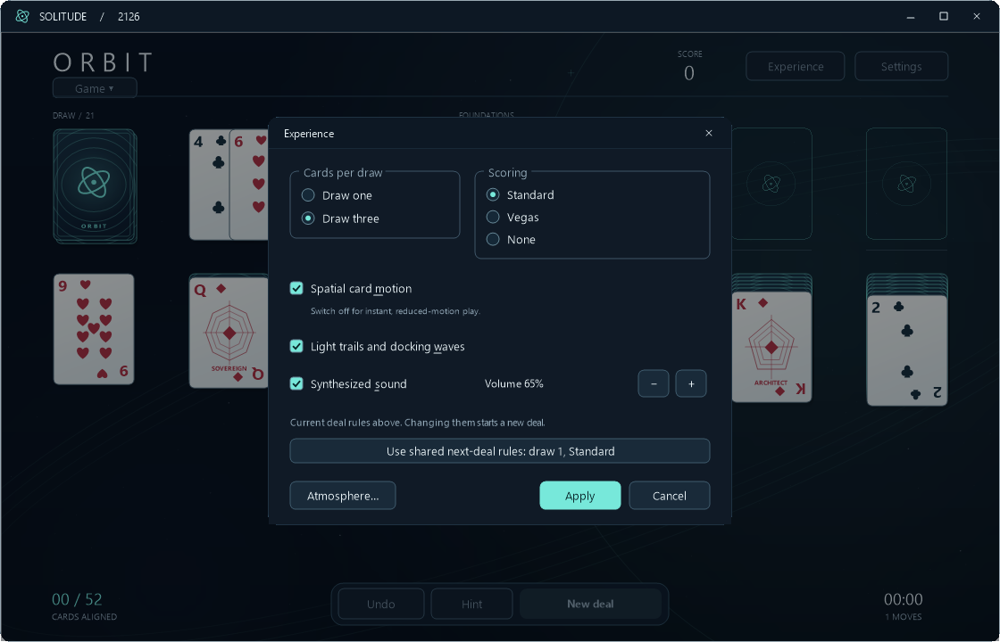
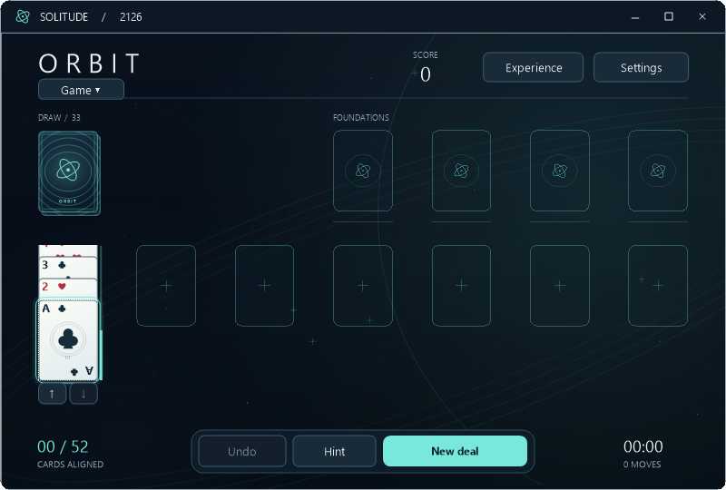

# ORBIT audit implementation — 0.11.0

This release implements the twelve items in the [11 September audit](ORBIT-AUDIT-2026-09-11.md). ORBIT has its own presentation and guidance changes; shared snapshot handling also changes to support cheaper saves. Historical hints, card art and period controls retain their existing policies.

| Item | Implementation and verification |
|---|---|
| O01: unreadable columns | Minimum 24-pixel face-up strips, horizontal rank/suit corners, wider waste fan, independent scrolling and automatic reveal for keyboard/accessibility/moves. The original fixture now exposes 24 px at 800 × 540 and 26.26 px at 1120 × 720, versus 3.83 and 12.92 px previously |
| O02: active/shared rules | Experience opens with current deal rules and explicitly offers differing shared next-deal rules. The XP → ORBIT reproduction now displays draw-three correctly, retains shared draw-one, and preserves the deal on unchanged Apply |
| O03: cycling hints | Dedicated ORBIT strategy prioritizes progress, excludes previously visited boards and offers alternatives/explanations. Seeds 1–40, up to 300 actions: zero repeated boards; 1 finished, 28 exhausted suggestions, 11 reached the bound. This is not a solvability estimate |
| O04: no-op completion | Simulate safe collection on a copy before showing completion; report when manual collection has no safe move. Stalled fixture no longer offers completion; finishable fixture does; simulation preserves live state |
| O05: accessibility | Accessible card/control objects expose names, roles, selection, bounds, navigation, actions and announcements, including modal dialogs. Initial board exposes 30 children; activation reveals an offscreen Ace; palette checked state tested. Narrator itself was not run |
| O06: frame costs | Faster moving-card sampling, bounded cached glow textures, incremental card-cache eviction, fewer hover redraws, adaptive 120/60 scheduling. Continuity tests retain full-frame flicker protection; measurements below |
| O07: save stalls | Frozen history snapshots reused by save worker; Undo copies before changing an old board; normal ORBIT settings/switch saves queued; compact JSON. 5,000-action snapshot allocation falls from 14,237,648 to 46,624 bytes. Snapshot isolation/full-session Undo tested, including Spider |
| O08: stale Undo waves | Undo clears old docking effects and does not schedule a new arrival for the reversal. Reproduced Ace/Undo case now has zero waves; interrupted position/bank tests pass |
| O09: screen fitting | Preserve requested scale but reduce effective scale to fit the work area; reevaluate on location/DPI changes. Small-work-area calculation fits 1366 × 728; physical multi-monitor movement remains untested |
| O10: palette details | Entire 96-pixel preview tile clickable/focusable; palette accent shared by caption, buttons, radios and checks. Preview click and accessible selection verified |
| O11: discoverability/text | Visible Game menu with Restart, Statistics and Flight manual; Ctrl+R; larger antialiased controls, readable metadata/court captions. Menu/action, dialog-bounds and visual checks |
| O12: sound | Saved 0–100% volume, distinct draw tone, one selected move sound per draw/Undo instead of redundant generic feedback. Apply/cancel/shared-volume checks and source review; audible output not assessed |

## Measurements

Machine load varied during this session. The original 0.10.1 benchmark executable was rerun to provide a nearer comparison. These are separate serial runs on the same machine, not simultaneous controlled hardware measurements. Values are offscreen CPU paint times, **not physical display FPS**.

| Scale | 0.10.1 moving median / p95 (ms), rerun | 0.11.0 moving median / p95 (ms) |
|---|---:|---:|
| 100% | 6.73 / 8.90 | 4.72 / 6.29 |
| 125% | 10.98 / 15.43 | 8.84 / 12.29 |
| 150% | 16.73 / 23.78 | 10.53 / 13.72 |
| 200% | 27.58 / 37.25 | 16.68 / 21.45 |

Moving workloads improved in this comparison, but rendering does not meet 120 Hz everywhere. The 200% p95 still exceeds a 60 Hz budget on this run. Adaptive scheduling lowers the requested rate to 60 when measured paints are too expensive and restores the user's target when costs recover. Settled costs remain comparable, with some intermediate-scale regressions within the observed run variation; this is not a claim that every frame is faster.

Win-sequence p95 paints were 6.76 / 12.35 / 17.95 ms at 100/150/200%. First-use paints were 123.57 / 70.75 / 93.40 ms; palette creation was 31.05 / 46.14 / 81.07 ms. Individual cold samples include setup work and are not steady-state costs. Caches reduce repeated work; first-use setup and physical presentation remain performance limits, not certified stutter-free behavior.

The 5,000-action snapshot measured 6.60 ms and 46.6 KB allocated, versus the audit's 24.29 ms and 14.24 MB. Each is a single cold stress sample. The substantive change is avoiding deep copies of every historical board, while retaining all Undo entries. Current state and mutable preferences/statistics still receive independent copies. The worker serializes frozen historical snapshots, and Undo clones an entry before changing it. Additional slow-disk fault injection was not performed.

Raw evidence: [fixed probes](audits/orbit-0.11.0/findings.json), [updated renderer](audits/orbit-0.11.0/performance.json), [old-build rerun](audits/orbit-0.11.0/baseline-recheck.json), [stock/win/cold samples](audits/orbit-0.11.0/interaction-performance.json).

## Validation

- Full UI suite: **19,695 passing checks**, including historical editions and ORBIT, cached/fresh frames, clipped repaints, double-click scope and interrupted animations.
- Final focused audit run: **13,881 passing checks**, overlapping the full suite and adding explicit adaptive-rate and Spider snapshot checks. Do not add these counts together.
- Shared rules/persistence: **53 groups passed**, including 60,000-action conservation and corrupted-save recovery.
- Final EXE/source renderer parity and hash: [VERIFICATION.md](VERIFICATION.md).
- Visually reviewed production images for the normal board, long-column top/bottom and shared-rules Experience dialog.

All tests were offscreen, without personal-save access or desktop input. Accessibility implementation follows Microsoft's [custom AccessibleObject guidance](https://learn.microsoft.com/en-us/dotnet/api/system.windows.forms.accessibleobject.getchild?view=windowsdesktop-10.0) and [notification API](https://learn.microsoft.com/en-us/dotnet/api/system.windows.forms.accessibleobject.raiseautomationnotification?view=windowsdesktop-10.0). Automated checks do not replace end-to-end Narrator use, listening, physical high-refresh display testing or a multi-monitor soak.

The updated EXE is a local build. This turn does not create a new GitHub release.
