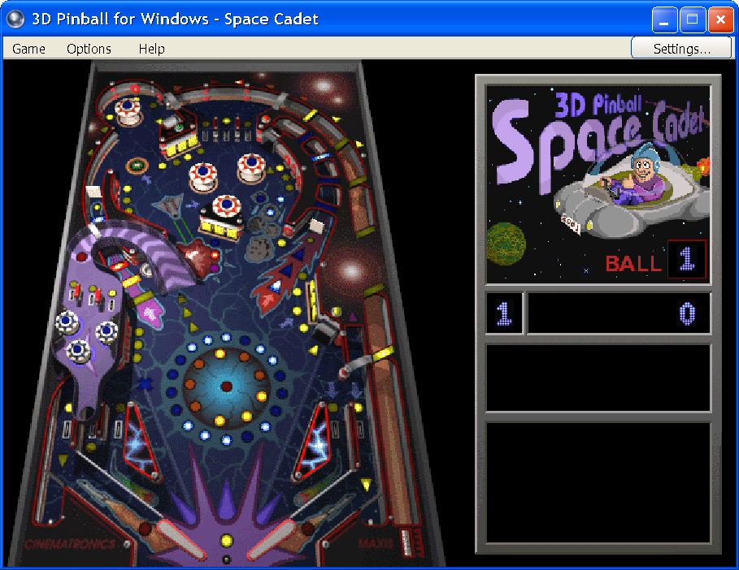
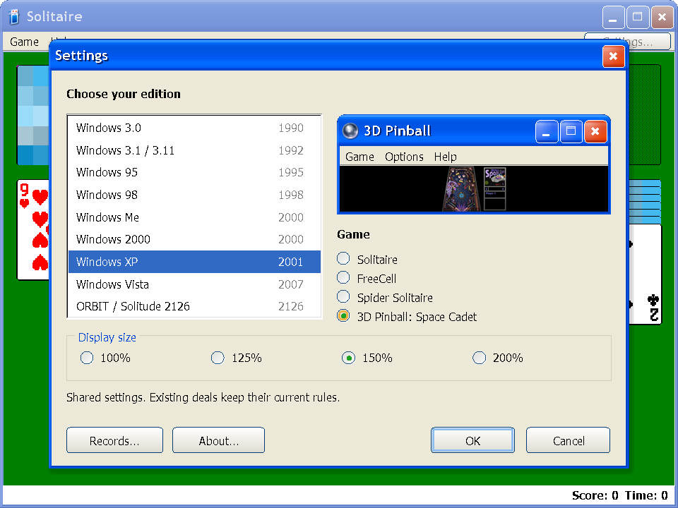
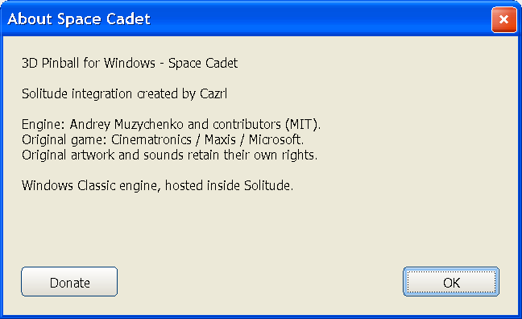

# Space Cadet Pinball — 0.12.0

Solitude now offers **Windows XP → 3D Pinball: Space Cadet**. The application remains one distributed EXE. It extracts a verified native DLL and the original game data into the selected save directory's `pinball/runtime` folder, then starts an isolated worker using the same EXE. No downloads are needed at play time.

The XP host includes Game, Options, Help and Settings. Hold Space and release to launch; Z and / operate the flippers. F2 starts a new game, F3 pauses, F4 maximizes/restores, and F6 returns to the edition/game selector. Original missions, ranks, scores, tilt, high scores, demo mode and one to four players come from the reconstructed classic engine. About credits Cazrl and upstream and includes Donate.

Pinball keeps its high scores, audio choices and key bindings in `pinball/settings.ini`. It does not use the original Pinball registry keys. Closing Pinball remembers the game selection for the next launch; returning to Settings leaves the last card deal available. An unfinished Pinball ball is not serialized or resumed. Existing card saves, undo history and compatible shared settings continue to use the existing store.

## Source and asset provenance

- Engine: [k4zmu2a/SpaceCadetPinball, WindowsClassic](https://github.com/k4zmu2a/SpaceCadetPinball/tree/20032b08931000da0dc6c508f270c9e5c728bcb6), commit `20032b08931000da0dc6c508f270c9e5c728bcb6`. Copyright Andrey Muzychenko and contributors, MIT. Full license retained in the vendored tree and embedded notices.
- Source archive SHA-256: `479F8A158A53BD8998116DB8F5545365EAADF0E165688AA42633C6F49E62B14C`.
- Original data: [alula's browser port](https://pinball.alula.me/), linked by the upstream README. Retrieved 2026-09-12 from `SpaceCadetPinball.data`; metadata was read from its accompanying JavaScript as data, never executed. Only PINBALL.DAT, FONT.DAT, MIDI, WAV and wavemix.inf entries were repacked. The unrelated README and table.bmp were excluded.
- Downloaded data SHA-256: `53EEA8DEFA123FC74D602FB89FEA87AFDAEDD93AB8D106F46C75130CE5AFD902`.
- PINBALL.DAT SHA-256: `42DEFD5D2A339A3953FE643716AFF4E35B2CEA7A3E54505C82D1E78D5325BC04`.
- Embedded content.zip SHA-256: `4314F451B4D7A825EBA7795465CCBD9E7FB6B4085B1580597937A8F7DDA9B278`.
- Native icon and compiled dialog/splash resources accompany the upstream classic source.

The engine license does **not** establish permission to redistribute the original Cinematronics / Maxis / Microsoft game assets. Their rights remain separate. This implementation is delivered locally; this turn does not publish a GitHub release.

## Verification

Delivered local EXE: **0.12.0.0**, **66,928,485 bytes**, SHA-256 `770F7240E301B3E229AEE3FC0A63B32EB7A92530804E582E97400B0A42AFE437`. The tested managed assembly matched the assembly published into this EXE. Embedded MIT notice export matched the source notice byte for byte. The personal card-save hash was unchanged.

The full regression gate passed 53 engine groups, 27,137 UI checks, 384 native card-game checks and 290 matching source/package renders. After the final Pinball-only preview, About and monitor-change refinements, the final packaged EXE passed 28 native Pinball integration checks, and the selector passed its 288 checks again. Build completed with zero warnings and zero errors. Detailed delivery identity is in `docs/audits/pinball-0.12.0-delivery.json`.

Native checks use isolated save directories and hidden/offscreen hosts. They exercise startup, three-ball initialization, simulation-clock rate, pause/resume, plunger input, both flippers and key release, focus loss, sounds, player-count switching, resize, demo, graceful shutdown, settings persistence, actual native table capture in the XP host, and F6 back to Settings. The selector checks cover every existing era at all four display scales, including draft cancellation and preservation of the active card state.

The native game has not been exhaustively compared against an original XP virtual machine. Mission and scoring behavior are inherited from the pinned upstream engine; a full campaign, subjective audio quality and physical-display frame pacing are not certified by these checks. Native Player Controls and High Scores use the engine's original dialog resources rendered by the current Windows host, so those dialogs are not an exact XP theme recreation.

Build and test evidence is retained under `artifacts/pinball`. Source data and research are retained; no earlier research was deleted for this integration.
